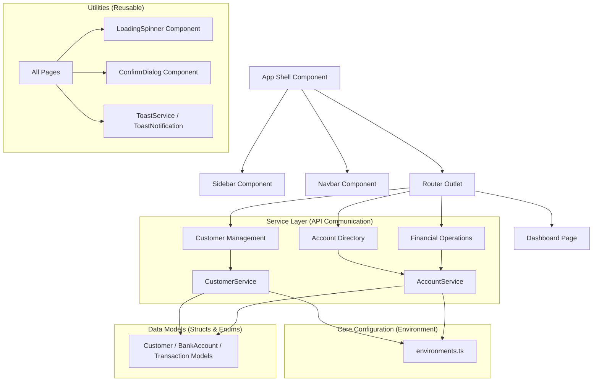

# Digital Banking Application (Frontend)

Developed by **HYNDI ELMEHDI**

A clean, modern, and high-performance Digital Banking Frontend built on top of Angular 21 and styled with a custom CSS Design System. The application features real-time client-side rendering (SPA), reactive form validations, loading states, a toast notification system, and fully responsive layouts.

---

## Architecture Design

The application follows a structured, clean-architecture pattern separating model schemas, service layers, reusable UI presentation components, and layout views.

### File Structure Map

```text
src/
├── app/
│   ├── components/            # Reusable & Shared Components
│   │   ├── confirm-dialog/    # Modal dialog for critical operations
│   │   ├── loading-spinner/   # Spinner component for async requests
│   │   ├── navbar/            # Global header dashboard navbar
│   │   ├── sidebar/           # Left navigation bar
│   │   └── toast-notification/# Floating toast alerts
│   │
│   ├── models/                # Type Definitions & Data Structures
│   │   ├── customer.model.ts
│   │   ├── bank-account.model.ts (Current & Saving polymorphism)
│   │   ├── account-operation.model.ts
│   │   ├── account-history.model.ts (Paginated transaction lists)
│   │   ├── transaction.model.ts (Requests for credit, debit, transfer)
│   │   ├── account-status.enum.ts
│   │   └── operation-type.enum.ts
│   │
│   ├── services/              # Business Logic & API Layer
│   │   ├── customer.service.ts
│   │   ├── account.service.ts
│   │   └── toast.service.ts
│   │
│   ├── pages/                 # Main Page/View Controllers
│   │   ├── dashboard/         # Stat widgets & app telemetry dashboard
│   │   ├── customers/         # Customer Management (List, Add, Edit)
│   │   ├── accounts/          # Account Details & Paginated Transactions
│   │   └── transactions/      # Financial Operations (Debit, Credit, Transfer)
│   │
│   ├── app.config.ts          # Core Providers (HTTP Client, Router, SSR)
│   ├── app.routes.ts          # Page Route Configuration
│   ├── app.routes.server.ts   # Server Route Render Rules (SSR/Server/Prerender)
│   └── app.ts                 # Main Shell Component
│
├── environments/              # Environments configuration
│   ├── environment.ts
│   └── environment.prod.ts
│
├── index.html                 # HTML Shell (Google Fonts Integration)
└── styles.css                 # Brand Design System Tokens
```

### Architectural Layout Diagram



---

## App Workflows & Features

The digital banking dashboard encompasses five primary workflows, all fully integrated:

### 1. Unified Dashboard Insights
- Displays financial telemetry (total customers, active bank accounts, total savings, and total overdraft limits).
- Lists quick shortcuts for initiating debits, credits, or transfers.
- Provides a clean overview of the banking application's distribution.

### 2. Customer Management (CRUD)
- **Retrieve**: Clean table representation containing customer identifiers, names, and contact details.
- **Search**: Integrated query filter to retrieve specific clients.
- **Create**: Add a new customer profile using dynamic reactive validations.
- **Update**: Pre-filled update forms to modify profile attributes.
- **Delete**: Protected action with an interactive Confirm Dialog before invoking remote API calls.

### 3. Bank Account Directory
- Divided into Current and Saving accounts, displayed as visual cards.
- Supports card badge colors mapping to the account status (CREATED, ACTIVATED, SUSPENDED).
- Clicking on any account redirects to the Account Detail view.

### 4. Account Details & Paginated Transaction History
- Showcases detailed account summaries, including creation date, balance, and metadata (overdraft or interest rate).
- Renders an interactive transaction ledger (Debit/Credit indicators).
- **Pagination**: Supports dynamically requesting historical logs from the API with options for page size (5, 10, 20 items).

### 5. Financial Operations
- Forms to submit Debit or Credit requests against account IDs.
- **Transfers**: Inter-account wire transfers supporting validation of source and destination accounts.
- Built-in error handlers mapping failure outputs from API gateways to client toast notifications.

---

## Brand Design System Tokens

The application features a custom design system initialized inside `src/styles.css`:

| Token | Property / Value | Purpose |
|---|---|---|
| `--color-primary` | `#3b82f6` (Indigo/Blue) | Brand colors for main actions |
| `--color-accent` | `#0f766e` (Teal) | Accented sections |
| `--color-success` | `#10b981` (Green) | Successful/Credit status badges |
| `--color-danger` | `#ef4444` (Coral Red) | Suspended/Debit status badges |
| `--color-bg-primary` | `#f8f9fc` (Slate Blue/Gray) | Layout viewport background |
| `--color-bg-secondary`| `#ffffff` | Elevated component cards |
| `--color-bg-sidebar` | `#0f172a` (Slate Black) | Dark professional sidebar |
| `font-family` | `'Inter', sans-serif` | Premium sans-serif typography |
| `Border Radius` | `6px` / `10px` / `16px` | Smooth card and button profiles |
| `Transitions` | `all 0.2s cubic-bezier` | Micro-interactions and hover animations |

---

## Application Screenshots

Here are snapshots of the application UI:

### 1. Dashboard View


### 2. Customer Management
| Customer List | Search Filter | Add Customer |
| --- | --- | --- |
|  |  |  |

### 3. Accounts Directory & Details
| Accounts Cards | Account Details | Paginated History |
| --- | --- | --- |
|  |  |  |

### 4. Transactions & Operations
| Credit / Debit Form | Operation Verification | Transfer Setup |
| --- | --- | --- |
|  |  |  |

---

## Development & Execution Guide

### Prerequisites
- Node.js (v18+)
- NPM (v9+)
- Angular CLI installed globally (`npm i -g @angular/cli`)

### Getting Started

1. **Install dependencies**:
   ```bash
   npm install
   ```

2. **Configure Backend API URL**:
   Ensure `src/environments/environment.ts` points to your running backend:
   ```typescript
   export const environment = {
     production: false,
     apiBaseUrl: 'http://localhost:8085'
   };
   ```

3. **Run local dev server**:
   ```bash
   npm start
   ```
   Open your browser to `http://localhost:4200/`.

4. **Production Build**:
   ```bash
   npm run build
   ```
   The compiled single-page application outputs to `dist/digital-banking-frontend`.
