# Digital Banking Application - Frontend Client

Developed by **HYNDI ELMEHDI**

A modern, high-performance web interface for the Digital Banking Application. This client is built using Angular 21 with Standalone Components, reactive state management via Signals, and a bespoke CSS design system. It handles real-time data fetching, reactive form validations, dynamic theme styling, and responsive layout adjustments.

---

## Technical Stack

* **Framework**: Angular 21 (Standalone Architecture)
* **State Management**: Angular Signals and Computeds
* **Styling**: Custom CSS Design System (no TailwindCSS or CSS frameworks)
* **Http Client**: RxJS Observables and HttpClient
* **Build Engine**: Vite and Angular CLI Build Pipeline

---

## Project Structure

The project directory is structured as follows to ensure separation of concerns:

```text
src/
├── app/
│   ├── components/            # Reusable UI presentation layers
│   │   ├── confirm-dialog/    # Pop-up modal for action approvals
│   │   ├── loading-spinner/   # Indeterminate progress spinner
│   │   ├── navbar/            # Global navigation header
│   │   ├── sidebar/           # Left drawer navigation
│   │   └── toast-notification/# System status overlay manager
│   │
│   ├── models/                # TypeScript schemas and data definitions
│   │   ├── customer.model.ts
│   │   ├── bank-account.model.ts (Polymorphic account hierarchy)
│   │   ├── account-operation.model.ts
│   │   ├── account-history.model.ts (Paginated transaction definitions)
│   │   ├── transaction.model.ts (Form request payloads)
│   │   ├── account-status.enum.ts
│   │   └── operation-type.enum.ts
│   │
│   ├── services/              # Business logic services and REST APIs
│   │   ├── customer.service.ts
│   │   ├── account.service.ts
│   │   └── toast.service.ts   # Signal-based toast publisher
│   │
│   ├── pages/                 # Routing view controllers
│   │   ├── dashboard/         # Stat telemetry widgets
│   │   ├── customers/         # Customer directory and profile modifications
│   │   ├── accounts/          # Account detail profiles and paginated history
│   │   └── transactions/      # Financial processing (Debit, Credit, Transfer)
│   │
│   ├── app.config.ts          # Core application providers and settings
│   ├── app.routes.ts          # Angular SPA route registry
│   └── app.ts                 # Root shell component
│
├── environments/              # Compilation environment configurations
│   ├── environment.ts
│   └── environment.prod.ts
│
├── index.html                 # HTML viewport entry point
└── styles.css                 # Base stylesheet and variables
```

---

## Core Application Workflows & Interface Snapshots

### 1. Account Telemetry Dashboard
* Aggregates total client count, active bank account counts, and combined deposit balances across the system using RxJS parallel forkJoin requests.
* Provides recent transaction lists populated from active bank accounts.
* Integrates quick-access navigation buttons for common bank administrative tasks.

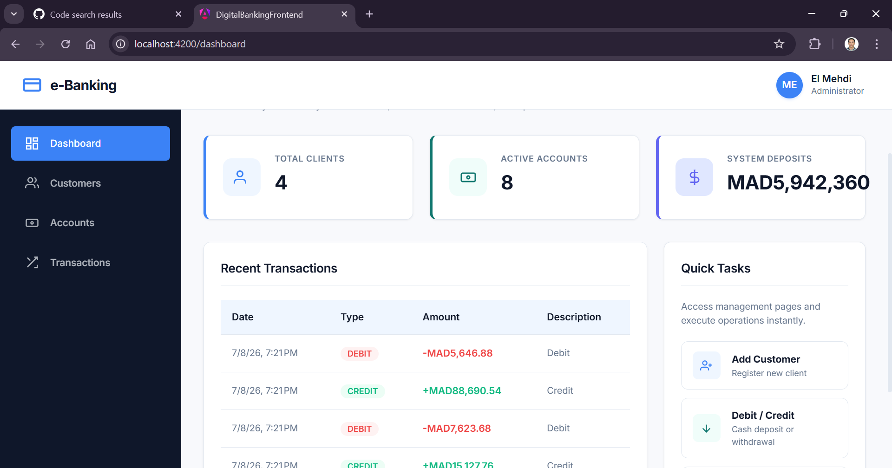

### 2. Client Profile Management (CRUD)
* Lists registered clients in a clean tabular layout with client-side name/email filters powered by computed Signals.
* Provides dynamic inputs validated using Angular Reactive Forms.
* Restricts critical actions (such as customer deletion) behind confirmation pop-ups before dispatching HTTP calls.
* Leverages JPA cascade configurations on the backend to automatically delete linked accounts and transaction histories when a customer is removed.

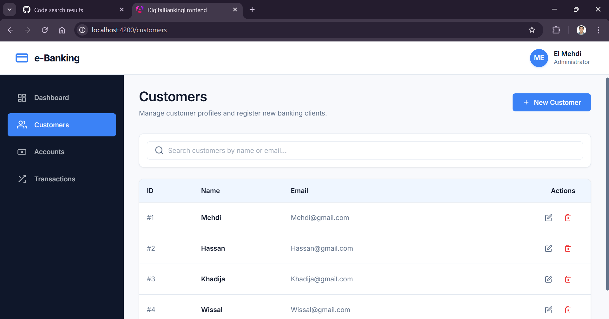
*Figure 2a: Customer listing table with action items.*

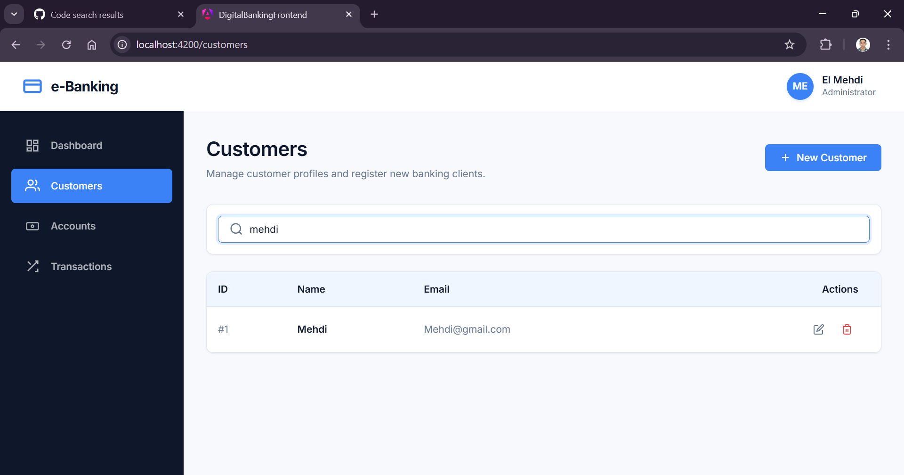
*Figure 2b: Reactive client-side keyword search.*

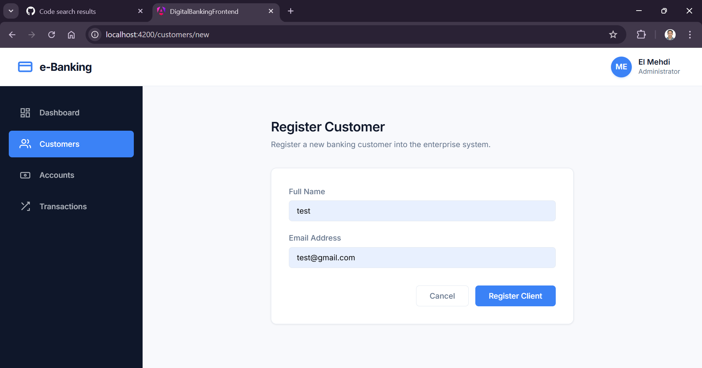
*Figure 2c: Reactive Customer registration form showing real-time validation inputs.*

### 3. Bank Account Directory
* Represents bank accounts as responsive, colored cards containing owner names, formatted balances, and type-specific rules (overdraft caps or interest rates).
* Displays a detailed view of a single account's profile, including creation dates, status indicators, and owner contact details.

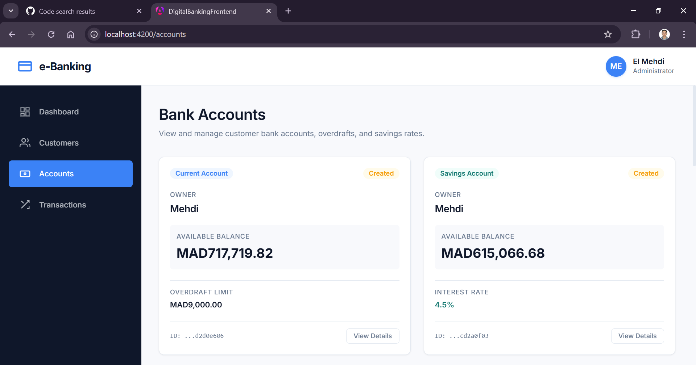
*Figure 3: Bank account directory grid layout.*

### 4. Account Details & Paginated Transaction History
* Showcases detailed account summaries, including creation date, balance, and metadata (overdraft or interest rate).
* Renders an interactive transaction ledger (Debit/Credit indicators).
* **Pagination**: Supports dynamically requesting historical logs from the API with options for page size (5, 10, 20 items).

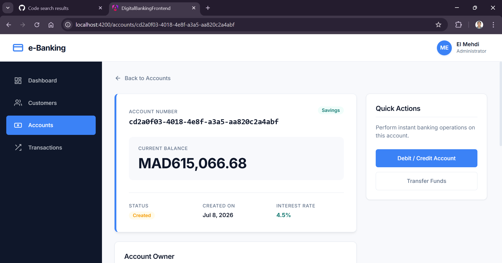
*Figure 4a: Account information dashboard header.*

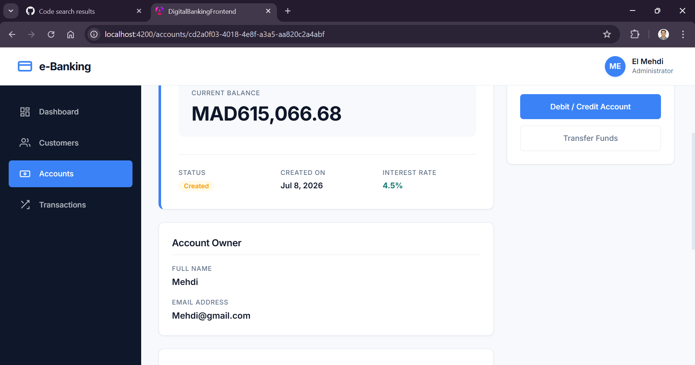
*Figure 4b: Linked account owner profile information.*

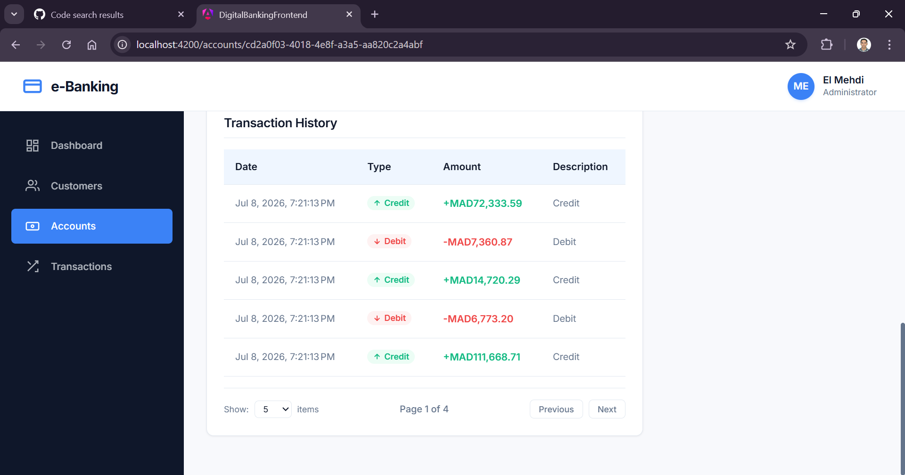
*Figure 4c: Paginated transaction ledger showing operation types and dates.*

### 5. Transfer & Financial Transactions
* Includes forms to execute account debits (withdrawals) and credits (deposits).
* Implements multi-account wire transfer forms with verification validations that prevent source and target account IDs from matching.
* Handles API errors gracefully, returning structured exceptions like insufficient balances as readable toast alerts.

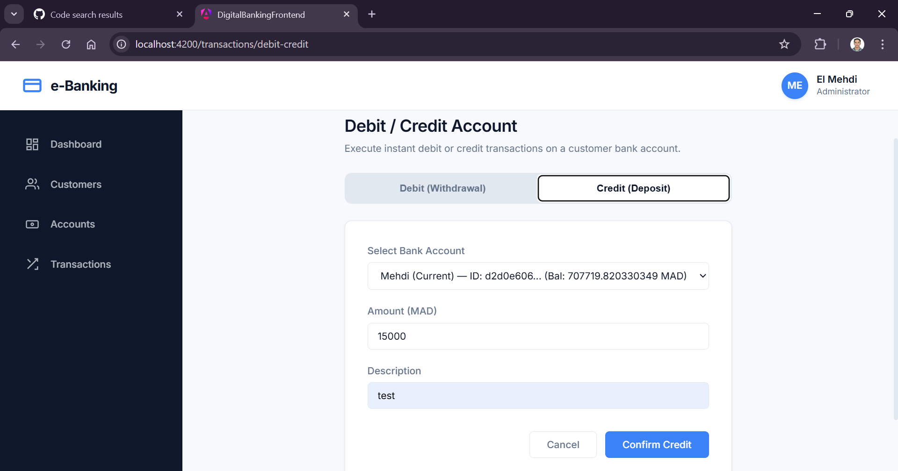
*Figure 5a: Basic credit or debit selection toggle page.*

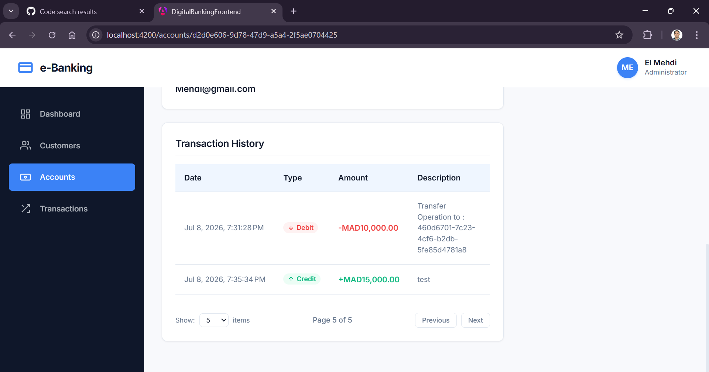
*Figure 5b: Real-time form validators showing mandatory inputs.*

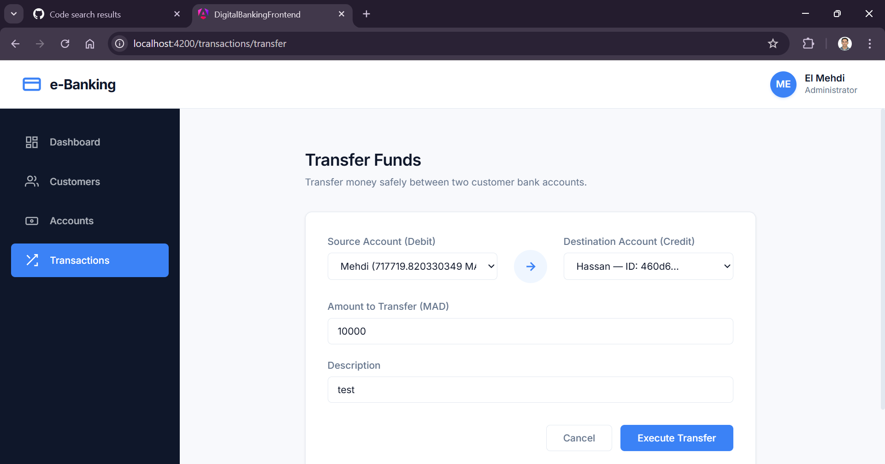
*Figure 5c: Account-to-account transfer layout with a directional flow indicator.*

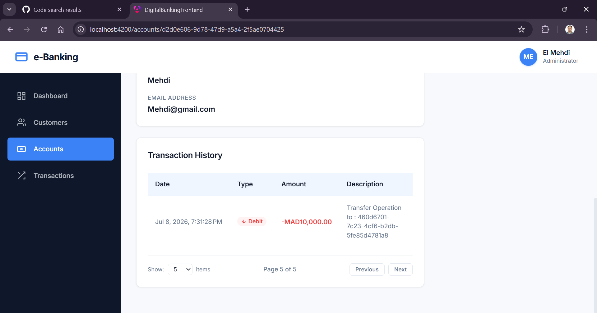
*Figure 5d: Source account validation checks.*

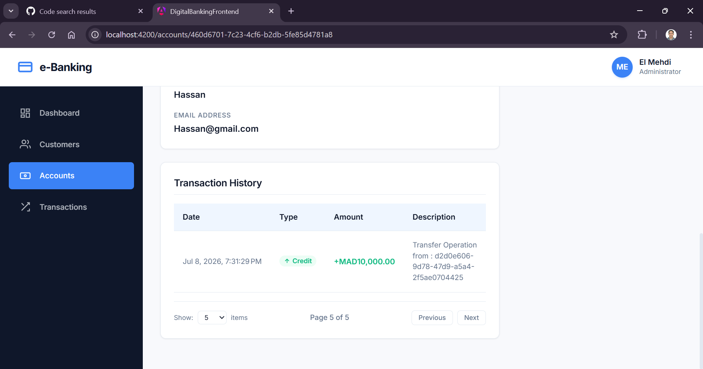
*Figure 5e: Destination account validation checks.*

---

## Running the Application

### Prerequisites
* **Node.js** (version 18 or higher)
* **NPM** (version 9 or higher)

### Setup & Local Development

1. **Install dependencies**:
   ```bash
   npm install
   ```

2. **Configure Connection Properties**:
   Ensure `src/environments/environment.ts` points to your Spring Boot REST server:
   ```typescript
   export const environment = {
     production: false,
     apiBaseUrl: 'http://localhost:8085'
   };
   ```

3. **Start the dev server**:
   ```bash
   npm start
   ```
   The client will be available at `http://localhost:4200/`.

4. **Compile Production Bundle**:
   ```bash
   npm run build
   ```
   The compiled frontend bundle will be generated under `dist/digital-banking-frontend`.
